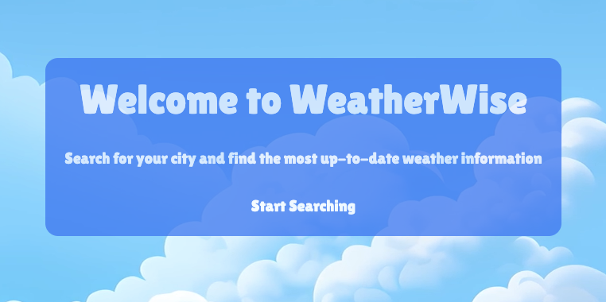
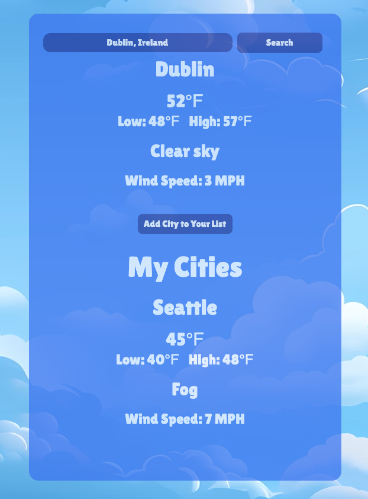

# WeatherWise

Welcome to WeatherWise, a simple but accurate weather app that accesses current weather around the world. 

Utilizing Open Weather's API, WeatherWise allows you to find cities worldwide and get the most current forecast. Save yourself the trouble of searching every time you open the app and add any city to your own personal list to refer back to.

## User Flow

Users will be greeted with a Home Page introducing them to the app. From there, you can access the weather page, where you can search for locations, and/or view the cities you have already saved. 

Upon searching for a city, the user will be able to see the current weather data and have the option to save that city to their own personal list.

## Getting Started 

Click on this link to open the app and start searching!

WeatherWise: https://timely-snickerdoodle-57a02c.netlify.app/ 

Trello Board: https://trello.com/b/2A1YCBkg/weather-app 

## Next Steps

Over time, WeatherWise will continue to evolve and gain additional useful features, including:

- Animated SVG's to replicate the current weather data from each search.
- A potential new API to include not only current, but projected weather data. 
- Enhanced organization -- saved locations will render on a separate page, keeping the search bar, and a user's saved list of cities in different yet accessible locations.